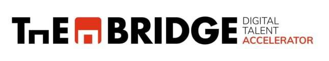

<!--  -->

<!-- 

  

    
  

  

    
  

 -->

# **Data Science Online Octubre 2024 - Abril 2025, Repo de Ejercicios**
  - [**Descripción**](#descripción)
  - [**Comentarios y Aclaraciones**](#comentarios-y-aclaraciones)
  - [**Clonar y actualizar repositorio**](#clonar-y-actualizar-repositorio)

**Descripción**
------------

Bienvenido al repositorio de acompañamiento al curso Online de Data Science de TheBridge dedicado en exclusiva a los enunciados de los ejercicios (de entrenamiento, extras y obligatorios).

El repositorio se divide en los mismos módulos que el repositorio principal:

1. Programación Básica y Ramp Up
2. Programación Avanzada: Numpy y Pandas
3. Análisis de Datos
4. Machine Learning
5. Deep Learning
6. Data Engineering

En cada módulo irás encontrando, agrupados por sprints y unidades, los enunciados de los ejercicios.

IMPORTANTE: Las soluciones que se publiquen lo serán en [el Repo principal del curso](https://github.com/rodolso/DS_Online_Octubre24.git) 

**Comentarios y Aclaraciones**
----------------------------

El repositorio contiene la mayoría de los ejercicios aunque pueden ir añadiéndose nuevos problemas y notebooks, así que no dejes de consultar tu Github desktop o hacer algún pull diario.

**Clonar y actualizar repositorio**
----------
1. Moverse a la carpeta local en la que deseamos clonar el repo. Por ejemplo: 
`
cd Documents/GitHub
`
2. Abrir Git Bash en ese directorio.
3. Clonar el repositorio
`
git clone https://github.com/rodolso/DS_Online_Octubre24_Exercises.git
`
4. Hacer `git pull` para actualizar.
